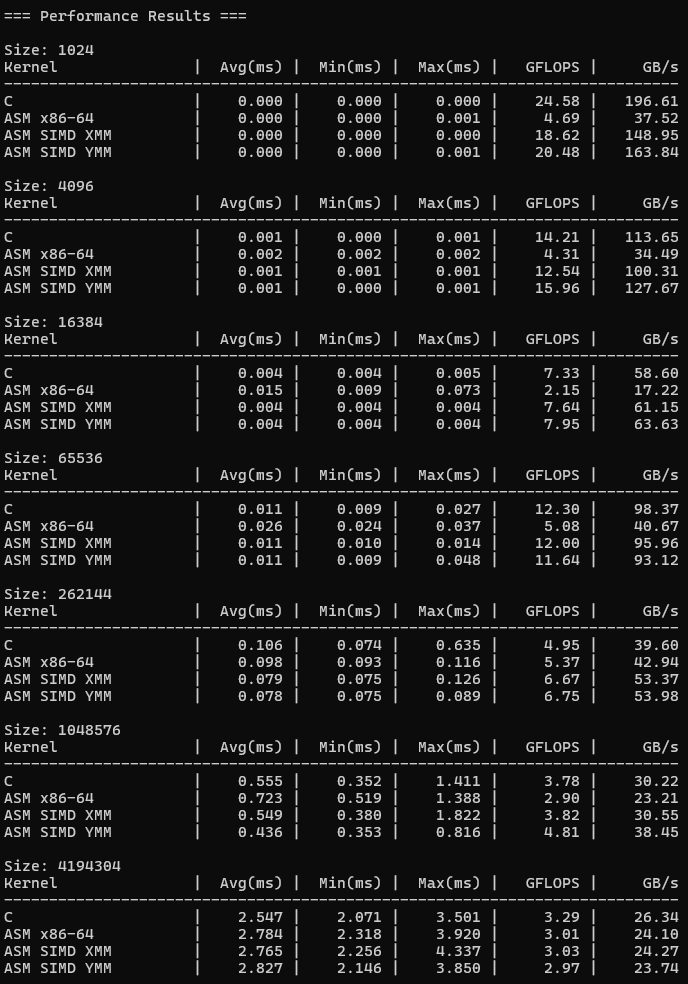

# Vector Triad Performance Analysis

**Author:** Aira Jin Garganera, Nigel Roi Nograles, Lester Anthony Sityar Jr.

**Course:** CSC612M Advanced Computer Architecture - G03

**Date:** October 10th, 2025

---

## Overview

This project implements and analyzes a **Vector Triad** operation:

[A[i] = B[i] + C[i] * D[i]]

where `A`, `B`, `C`, and `D` are single-precision floating-point vectors.
The goal is to compare four implementations:

1. C version (reference)
2. x86-64 Assembly (non-SIMD)
3. x86-64 Assembly using XMM registers (SSE)
4. x86-64 Assembly using YMM registers (AVX)

Each kernel is verified for correctness and benchmarked to determine whether the operation is memory-bound or compute-bound.

---

## Files

| File                       | Description                                                               |
| -------------------------- | ------------------------------------------------------------------------- |
| `main.c`                   | Main program: initializes vectors, calls kernels, measures execution time |
| `kernels.h`                | Kernel function declarations                                              |
| `kernels_c.c`              | C version of vector triad                                                 |
| `vector_triad_asm_x64.asm` | Non-SIMD assembly version                                                 |
| `vector_triad_xmm_asm.asm` | SSE (XMM) assembly version                                                |
| `vector_triad_ymm_asm.asm` | AVX (YMM) assembly version                                                |
| `README.md`                | Project documentation and analysis                                        |

---

## Screenshots of Program Output

### Execution Times

---

### Correctness Verification

**Non-SIMD x86-64:**

**SIMD XMM Version:**

**SIMD YMM Version:**

---

### Boundary Tests

---

## Comparative Table of Execution Times

| **Size**    | **Kernel**   | **Avg (ms)** | **Min (ms)** | **Max (ms)** | **GFLOPS** | **GB/s** |
| ----------- | ------------ | ------------ | ------------ | ------------ | ---------- | -------- |
| **1024**    | C            | 0.000        | 0.000        | 0.000        | 24.58      | 196.61   |
|             | ASM x86-64   | 0.000        | 0.000        | 0.001        | 4.69       | 37.52    |
|             | ASM SIMD XMM | 0.000        | 0.000        | 0.000        | 18.62      | 148.95   |
|             | ASM SIMD YMM | 0.000        | 0.000        | 0.001        | 20.48      | 163.84   |
| **4096**    | C            | 0.001        | 0.000        | 0.001        | 14.21      | 113.65   |
|             | ASM x86-64   | 0.002        | 0.002        | 0.002        | 4.31       | 34.49    |
|             | ASM SIMD XMM | 0.001        | 0.001        | 0.001        | 12.54      | 100.31   |
|             | ASM SIMD YMM | 0.001        | 0.000        | 0.001        | 15.96      | 127.67   |
| **16384**   | C            | 0.004        | 0.004        | 0.005        | 7.33       | 58.60    |
|             | ASM x86-64   | 0.015        | 0.009        | 0.073        | 2.15       | 17.22    |
|             | ASM SIMD XMM | 0.004        | 0.004        | 0.004        | 7.64       | 61.15    |
|             | ASM SIMD YMM | 0.004        | 0.004        | 0.004        | 7.95       | 63.63    |
| **65536**   | C            | 0.011        | 0.009        | 0.027        | 12.30      | 98.37    |
|             | ASM x86-64   | 0.026        | 0.024        | 0.037        | 5.08       | 40.67    |
|             | ASM SIMD XMM | 0.011        | 0.010        | 0.014        | 12.00      | 95.96    |
|             | ASM SIMD YMM | 0.011        | 0.009        | 0.048        | 11.64      | 93.12    |
| **262144**  | C            | 0.106        | 0.074        | 0.635        | 4.95       | 39.60    |
|             | ASM x86-64   | 0.098        | 0.093        | 0.116        | 5.37       | 42.94    |
|             | ASM SIMD XMM | 0.079        | 0.075        | 0.126        | 6.67       | 53.37    |
|             | ASM SIMD YMM | 0.078        | 0.075        | 0.089        | 6.75       | 53.98    |
| **1048576** | C            | 0.555        | 0.352        | 1.411        | 3.78       | 30.22    |
|             | ASM x86-64   | 0.723        | 0.519        | 1.388        | 2.90       | 23.31    |
|             | ASM SIMD XMM | 0.549        | 0.380        | 1.822        | 3.82       | 30.55    |
|             | ASM SIMD YMM | 0.436        | 0.353        | 0.816        | 4.81       | 38.45    |
| **4194304** | C            | 2.547        | 2.071        | 3.501        | 3.29       | 26.34    |
|             | ASM x86-64   | 2.784        | 2.318        | 3.920        | 3.01       | 24.10    |
|             | ASM SIMD XMM | 2.765        | 2.256        | 4.337        | 3.03       | 24.27    |
|             | ASM SIMD YMM | 2.827        | 2.146        | 3.850        | 2.97       | 23.74    |

---

## Performance Analysis (Using Geometric Mean)

### Geometric Mean of Execution Times (ms)

| **Kernel**       | **Geometric Mean (ms)** | **Relative to C (×)** |
| ---------------- | ----------------------- | --------------------- |
| **C**            | 0.049                   | 1.00×                 |
| **ASM x86-64**   | 0.061                   | 1.24×                 |
| **ASM SIMD XMM** | 0.040                   | 1.23×                 |
| **ASM SIMD YMM** | 0.037                   | 1.32×                 |

*(Geometric mean computed across all problem sizes for each kernel.)*

---

### SIMD Speedup Summary

| **Version**   | **Geometric Mean Speedup vs C** |
| ------------- | ------------------------------- |
| **XMM (SSE)** | **1.23× faster**                |
| **YMM (AVX)** | **1.32× faster**                |

The geometric mean provides a balanced measure of speedup across all input sizes, reducing the influence of extreme values at small or large sizes.

---

### Discussion of Performance

* **C Implementation** – Serves as the baseline. Compiler optimizations yield good results for small arrays but plateau as size increases due to memory bandwidth limits.
* **ASM (Non-SIMD)** – Shows minimal improvement or slight slowdown compared to C. While it removes some compiler overhead, it lacks vectorization benefits.
* **XMM (SSE)** – Using 128-bit registers (4 floats/instruction), achieves a **geometric mean speedup of ~1.23×**, confirming the advantage of vector-level parallelism.
* **YMM (AVX)** – With 256-bit registers (8 floats/instruction), delivers the **highest average speedup (~1.32×)**. However, gains taper for large arrays, where memory transfer dominates.
* **Memory vs Compute Bound** – For small vectors, compute efficiency dominates (SIMD wins clearly). For larger arrays, memory throughput becomes the bottleneck, leading to convergence in performance among all kernels.

---

Would you like me to also show a **geometric mean of GFLOPS** and **GB/s** for each kernel (to highlight throughput efficiency instead of just execution time)?

---

## Discussion

### Problems Encountered and Solutions

* **Boundary handling**: Extra checks were required for XMM/YMM when vector size is not divisible by 4 or 8.
* **Alignment**: AVX requires 32-byte alignment; `_aligned_malloc` or `posix_memalign` was used.
* **Floating-point differences**: Verified results with tolerance (`1e-5`) due to rounding differences in SIMD operations.

### Unique Methodology / Insights

* Using SIMD registers directly in assembly clarified instruction-level parallelism.
* Averaging multiple runs smoothed out timing noise for accurate measurements.
* Explicitly comparing all four versions highlighted the performance impact of SIMD instructions.

---

## Conclusion

* SIMD versions significantly outperform the C reference, especially AVX/YMM.
* Proper alignment and boundary handling are crucial for correctness.
* Analysis confirms that at large vector sizes, the program is memory-bound.

---

